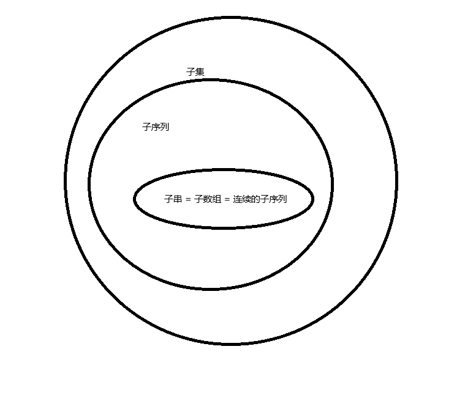

# 关系对比

## 子集

原序列任意位的组合加到一起，不需要考虑元素在原序列中的顺序，只考虑元素选于不选。

`For input [1,2,3], valid subsets of size 3 are [2,1,3],[1,2,3],[3,2,1]`

## 子序列

子序列是强调顺序的子集，不需要连续，但元素出现顺序要保持与原序列中的顺序相同。

`For input [1,2,3], valid subsequence of size 2 is [1,3]. Also, [3,1] is invalid`

## 子串/子数组

连续的子序列，可以通过嵌套for循环得到

```python
arr = [1,2,3]
res = []
for i in range(len(arr)):
    for j in range(i + 1, len(arr) + 1):
        res.append(arr[i:j])
```


